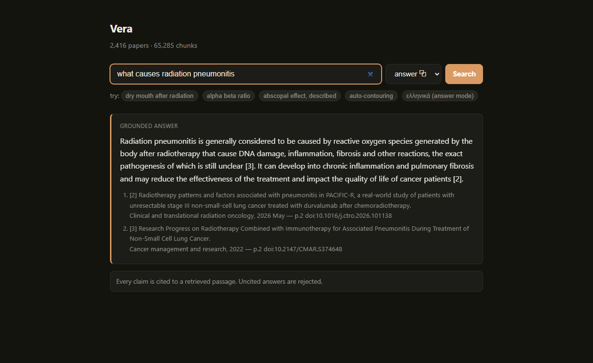

# Vera

**Hybrid lexical + neural search over 2,416 open-access radiation oncology papers.**

Named for *vera* — true. The point of the project is not that it retrieves, but
that the retrieval is measured, including where it loses.


> **This repository is a showcase; the implementation is private for now.**
> Published here are the database schema (`sql/`), the evaluation query set and all
> 515 relevance judgments (`data/`), the corpus definition (`data/topics.txt`), and
> the infrastructure definition — everything needed to check the method and the
> numbers. The Python package is available on request.

Ask it *"dry mouth after radiation treatment"* and it returns papers on
**xerostomia** — including a study of **amifostine**, the drug given to prevent
radiation-induced dry mouth. That paper shares no words with the query. Keyword
search scores it at exactly zero.

That gap — between the words a person uses and the words a literature uses — is
what this project is built to close, without giving up the exact matching that
clinical text depends on.

**What it does not do.** MedCPT resolves clinical *synonyms*, not arbitrary
paraphrase. `"abscopal effect"` retrieves abscopal papers at cosine distance 0.304;
`"tumour regression at a distant untreated site after radiotherapy"` — the same
concept, described rather than named — drifts to 0.411 and returns unrelated work.
The model was trained on PubMed search logs, where people search with terminology.
Synonym resolution is the honest claim; semantic understanding is not.

---

## The problem with each half

**Keyword search** can't match "dry mouth" to a paper that only says
"xerostomia". It compares strings, not meaning.

**Vector search** handles that easily, and then fails in the opposite direction:
*60 Gy* and *66 Gy* sit almost on top of each other in embedding space, as do drug
names differing by a syllable. In a clinical corpus that is precisely the wrong
thing to be approximate about.

So the system runs both and fuses the rankings.

---

## Pipeline

```
PMC Open Access  ──►  PDF extraction  ──►  pages  ──►  chunks  ──►  MedCPT  ──►  pgvector
   2,416 papers        PyMuPDF              24,330    65,285      768-dim       HNSW index
                                                                                     │
                            Postgres full-text search (tsvector + GIN) ───────────────┤
                                                                                     ▼
                                                                   Reciprocal Rank Fusion
```

| | |
|---|---|
| Documents | 2,416 |
| Pages | 24,330 |
| Chunks | 65,285 |
| Embedding | MedCPT (768-dim), L2-normalised |
| Store | PostgreSQL 17 + pgvector, HNSW / cosine |

---

## Decisions worth defending

Each of these was measured on the corpus, not assumed.

### Chunking is not optional

MedCPT reads 512 tokens. The median page here is **949**. Measured with the
model's own tokenizer:

| | |
|---|---|
| pages exceeding the 512-token budget | **86.6%** |
| tokens surviving if pages were embedded whole | **46.9%** |

Embedding pages directly would have discarded over half the corpus — silently, with
no error. Beyond truncation there's a subtler cost: an embedding is one point
representing everything it was shown, so a page spanning three topics lands between
all three and matches none well.

### Chunks belong to documents, not pages

Prose doesn't stop at page breaks. **34.2% of chunks cross a page boundary** —
chunking within pages would have severed 22,308 of them mid-sentence. Each chunk
records its true page range, so citations stay honest (`pp. 14–15`).

### Every chunk carries its title

MedCPT's input format is `[CLS] title [SEP] body [SEP]`. Passing the document title
as the first segment means chunk 14 of a paper still knows which paper it belongs
to — the usual context-loss problem of chunking, solved by the model's own input
contract rather than extra machinery.

### Normalise, then use cosine distance

Embeddings are L2-normalised at encode time, so cosine distance is bounded in
[0, 2] and comparable everywhere. Measured on 500 sampled chunks: **0 of 500
similarities were negative**, and the observed band was only **0.31 – 0.67**.
MedCPT's embeddings occupy a narrow cone; the theoretical range is not the usable
one.

### Fuse ranks, not scores

That narrow band is exactly why fusion uses **Reciprocal Rank Fusion**. Cosine
distance spans ~0.3 while `ts_rank_cd` is unbounded above, so blending the numbers
directly lets the lexical score dominate for reasons of scale alone. RRF discards
magnitudes and keeps only ordering:

```
score(d) = Σ  1 / (k + rank(d))        k = 60
```

---

## Evaluation

30 queries in three categories — **paraphrase** (lay wording vs. clinical term),
**exact** (acronyms, dose figures, named methods), and **conceptual** — scored with
TREC-style pooling: every retriever contributes candidates, the union is judged
blind, and all three systems are scored against the same labels.

**The lexical baseline is deliberately not handicapped.** Postgres's
`websearch_to_tsquery` ANDs bare terms, so a natural-language query like *"treating
a cancer that came back in the same place"* requires all seven content words in one
chunk and matches **nothing**. Four of the thirty queries returned zero lexical
results that way — and 28,179 chunks once the terms were OR-ed. Reporting the first
number would have made the vector retriever look far better than it is, by
measuring a query parser rather than an approach. The lexical retriever now falls
back to disjunctive matching, so every comparison is against an ordinary
bag-of-words baseline doing its best.

```bash
python -m vera.evaluate --pool && python -m vera.evaluate --label && python -m vera.evaluate --score
```

515 (query, document) pairs judged. **29 of 30 queries scored** — q07 is excluded
because no system retrieved a single relevant document for it, which leaves recall
undefined rather than zero.

### All queries (n=29)

| mode | Recall@10 | MRR | nDCG@10 |
|---|---|---|---|
| lexical | 0.511 | 0.750 | 0.646 |
| **semantic** | **0.655** | **0.937** | **0.815** |
| hybrid | 0.632 | 0.847 | 0.768 |

### By category

| | | Recall@10 | MRR | nDCG@10 |
|---|---|---|---|---|
| **paraphrase** (n=9) | lexical | 0.352 | 0.630 | 0.509 |
| | **semantic** | **0.777** | 0.907 | **0.884** |
| | hybrid | 0.549 | 0.840 | 0.724 |
| **exact** (n=10) | lexical | 0.491 | 0.883 | 0.695 |
| | semantic | 0.610 | **0.950** | **0.833** |
| | **hybrid** | **0.677** | 0.825 | 0.829 |
| **conceptual** (n=10) | **lexical** | **0.674** | 0.725 | 0.722 |
| | semantic | 0.592 | **0.950** | 0.734 |
| | hybrid | 0.662 | 0.875 | **0.748** |

### Two predictions that failed

**Hybrid did not win overall.** Semantic beats it on every headline metric. RRF
weights both retrievers equally, so fusing a strong ranking with a weak one drags
the strong one down — most visibly on paraphrase, where semantic scores 0.884 nDCG
alone and 0.724 once lexical is mixed in. Weighted or query-adaptive fusion is the
obvious next step, and the measurement is what identifies it.

**Lexical did not win on exact terminology.** It was expected to dominate queries
like *VMAT* and *alpha beta ratio*; semantic beat it there too (0.833 vs 0.695
nDCG). MedCPT is trained on biomedical text, so clinical acronyms are well
represented in its vocabulary rather than being opaque tokens. Lexical's only win
anywhere is Recall@10 on conceptual queries.

Hybrid's real contribution is narrower than the premise suggested: best Recall@10
on exact queries (0.677) and best nDCG on conceptual ones (0.748).

### How the labels were made

Judgments are binary and at the document level. **129 were made by the author;
386 were made by Claude** and are tagged `judge: "model"` in `data/eval_pool.jsonl`
so the two are separable.

To check whether the model labels are trustworthy, Claude re-judged a
deterministic 60-item sample of the author's labels **blind** — the labels were
withheld from the input. Agreement was **Cohen's κ = 0.755** (88.3% raw), which is
"substantial" on the Landis & Koch scale. The disagreements were entirely
one-directional: the model was stricter on 7 items and more lenient on **0**. The
model labels are therefore conservative rather than permissive, which matters here
because a permissive judge would have inflated exactly the semantic result above.

---

## Grounded answering



A fourth mode adds generation on top of retrieval — Qwen2.5-3B locally via Ollama.
It is **constrained rather than trusted**: the model sees only the retrieved
passages, must cite every claim with `[n]`, and the output is validated after
generation. Citation indices that were never supplied are rejected, uncited
answers get one corrective retry and are then refused, and `INSUFFICIENT` is a
legitimate result. Asked for the capital of France, or an insulin dose, it
declines — even though retrieval returns plausible-looking clinical text for the
second.

This is why retrieval was measured first. A wrong answer is **attributable**:
either the right passage was not retrieved (a number this project has) or it was
retrieved and the model misread it. Systems that fuse the two layers cannot tell
those apart.

**Greek questions** are translated to English before retrieval and the finished
answer is translated back, both by small dedicated `opus-mt` models (56M and 78M).
The 3B model never touches Greek: it rendered *ακτινική πνευμονίτιδα* (radiation
pneumonitis) as "the photoinitiator disease", and generating Greek directly
exceeded a 420-second timeout on a GTX 1050 Ti, where the round trip through
opus-mt completes in 23–29 seconds. Citation markers are compared before and
after back-translation; if they do not survive, the English answer is kept,
because an answer whose citations were mangled is no longer grounded.

## Flashcards, and a result that changed the design

The plan was to ground existing Anki decks against the corpus: take a card, find
the passages supporting it, quiz with citations. **It does not work, and measuring
why was more useful than the feature would have been.**

20 decks, 14,204 notes. Half are text-only (the rest carry their content in
images), leaving 6,298 cards. Of those, 2,868 passed a bi-encoder distance
threshold of 0.34 — but when an LLM judged whether the top passage *actually
stated* the card's answer:

| | supported |
|---|---|
| bi-encoder distance ≤ 0.34 | **4%** |
| + MedCPT cross-encoder ≥ 5 | **8%** |
| cross-encoder < 0 | 0% |

Distance measures topical proximity. In a corpus whose chunks already sit at
**0.707 mean similarity to each other**, the nearest neighbour to anything lands
near 0.3 whether or not the corpus contains the answer — and HNSW always returns
something.

The cross-encoder was added to fix exactly that, and in isolation it does:
for *"which nerves innervate the infrahyoid muscles?"* it rated the correct
passage **+13.6** and a topically-adjacent one about nodal margins **−15.1**,
where the bi-encoder saw 0.320 against 0.325. It changed the top passage for 79%
of cards. It still only moved support from 4% to 8%.

That is the reranker working, not failing. **The corpus does not contain the
answers.** The decks ask for AJCC staging definitions, ICRP dose limits and
chemotherapy regimens; these are 2,416 research papers, and papers report studies
rather than defining N2 staging. No retrieval improvement fixes missing content.

So the direction was inverted: cards are **generated from passages**, where
grounding holds by construction, and the cross-encoder checks each generated
question against its own source to catch drift. Deck grounding rates are kept as
a coverage measurement — radiation oncology decks score 81–84%, diagnostic
radiology 6–12% — which is a map of what this corpus can and cannot teach.

## Known limitations

**Bibliography chunks leak into results.** Reference lists are the most
keyword-dense text in any paper and contain no findings, so they rank well and
say nothing. A generated `is_reference` column filters numbered-entry style
(`12. Coles CE, Griffin CL,`), catching 13.9% of chunks with no false positives in
sampling. Bracketed style (`[114] N. Cirillo,`) is **not** filtered: at a
threshold of 4 matches it caught 2.9% of chunks but flagged genuine related-work
prose, and at 8 matches it caught 0.4% at roughly 6/7 precision. Neither was
applied, because `is_reference` feeds the retrieval `WHERE` clause — changing it
would alter rankings and invalidate the evaluation above, which is a poor trade
for a cosmetic gain. Fixing it properly means re-pooling and re-judging.

**Descriptive paraphrase is not handled** — see the note at the top. This is a
property of MedCPT's training distribution, not a bug in the pipeline.

**A supported flashcard is not necessarily a useful one.** The cross-encoder
measures whether a passage answers a question, which is not whether the question
is worth asking. A hazard ratio from a single durvalumab trial scored **+15.9**
and was kept; *"the most important dose-limiting toxicity in radiation"* scored
+4.7 and was rejected. Passages from methods sections reliably produce methods
trivia. Selecting source passages by section — introduction and discussion rather
than methods and results — is the obvious lever and is untouched.

**Generation is not evaluated.** Retrieval has nDCG@10 = 0.815; the answer layer
has anecdotes. Groundedness — does each cited claim actually appear in the passage
it cites — needs its own gold set and its own metrics. Until that exists, the
structural checks are the only guarantee, and they verify that a citation *exists*,
not that it *supports* the sentence.

**Greek back-translation makes terminology errors.** opus-mt rendered "residual
secretory capacity" as *υπολειπόμενη ικανότητα μυστηρίου* — "residual capacity of
mystery", confusing *secretory* with *secret*. It is far better than the 3B model
at this, and still not safe for clinical wording. The English answer is preserved
alongside the Greek in every response (`answer_english`) so the original is always
inspectable.

**The corpus is not purely English, and the chunker degrades what isn't.** PMC
returned 17 non-English articles (mostly Chinese, identifiable by PubMed's
bracketed-title convention). CJK text carries no Latin sentence punctuation, so a
whole page becomes one "sentence", overflows the 450-token target, and falls
through to `_split_oversized()` — which tokenizes and decodes back. MedCPT's
tokenizer is uncased and its vocabulary is English biomedical, so that round trip
lowercases the text and replaces out-of-vocabulary characters with `[UNK]`.
**195 chunks across 32 documents (0.30%) contain `[UNK]`.** Those documents are
effectively unsearchable. The right fix is to detect language at ingest and either
route non-English text to a multilingual encoder or exclude it, rather than
silently mangling it.

## Running it

Shown for shape rather than as a working recipe — the `vera` package is not in
this repository. The schema and compose file here are the real ones.

```bash
docker compose up -d
```

```bash
python -m vera.ingest data/pdfs && python -m vera.chunk && python -m vera.embed
```

Then search, from the CLI in any of three modes:

```bash
python -m vera.search_hybrid "dry mouth after radiation" --mode hybrid
```

or in the browser at `http://127.0.0.1:8000`:

```bash
uvicorn vera.api:app
```

The embedding run takes ~2 hours on a GTX 1050 Ti and is interrupt-safe: it
commits every 256 chunks and re-running continues where it stopped.

---

## Layout

The modules below are in the private repository; the table describes the system's
structure.

| Module | Role |
|---|---|
| `vera/fetch_pmc.py` | Corpus acquisition from PMC Open Access |
| `vera/ingest.py` | PDF → `documents` + `pages` |
| `vera/chunk.py` | Sentence-packed, page-attributed chunking |
| `vera/semantic.py` | MedCPT query + article encoders |
| `vera/embed.py` | Resumable batch embedding |
| `vera/search_lexical.py` | Postgres full-text search |
| `vera/search_hybrid.py` | RRF fusion, `--mode lexical\|semantic\|hybrid` |
| `vera/evaluate.py` | Pooled relevance judging and metrics |
| `vera/api.py` | FastAPI search UI |
| `vera/rag.py` | Grounded answering, Greek translation |
| `vera/quiz.py` | Flashcard import, grounding, and generation |

Schema migrations are numbered in `sql/`, applied by `scripts/apply_sql.sh`.

The Postgres database, role and container are still named `radonc` — the product is
Vera, the schema is named for its domain. Renaming a database holding 65,285
embeddings buys nothing but risk.

---

## Stack

Python · PostgreSQL 17 · pgvector (HNSW) · PyTorch · Hugging Face Transformers ·
MedCPT · PyMuPDF · Docker
